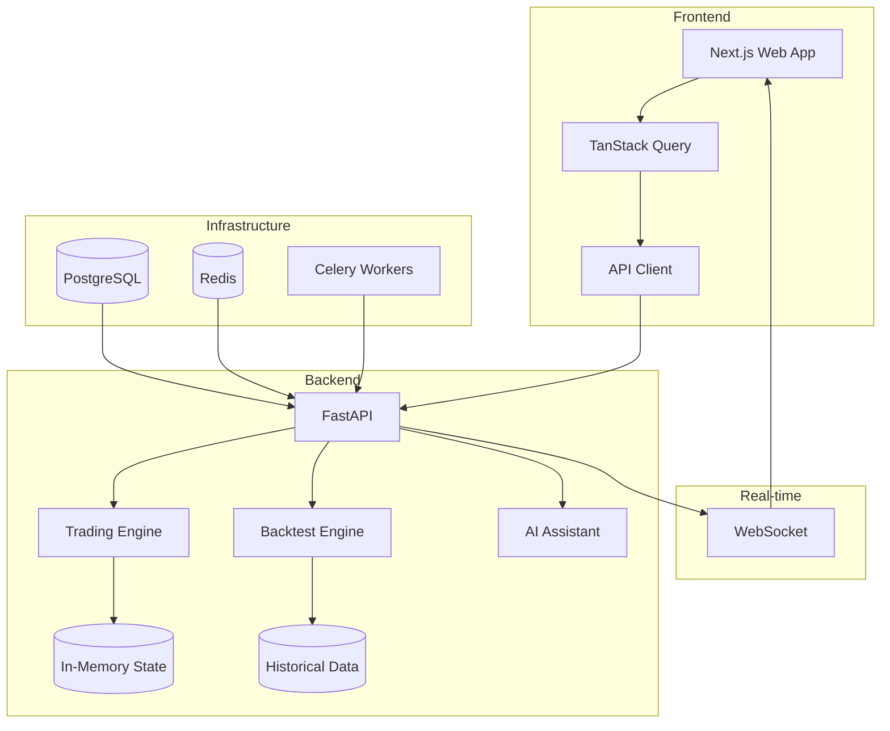

# Getting Started

Welcome to the Trading Simulator! This guide will help you get up and running quickly.

## What You'll Learn

- How to install and configure the trading simulator
- How to start paper trading with virtual money
- How to backtest trading strategies
- How to use the AI assistant for trading insights

## Prerequisites

Before you begin, make sure you have the following installed:

- **Node.js** 20 or higher
- **pnpm** 9.0 or higher
- **Python** 3.11 or higher
- **Docker** (optional, for database services)

## Architecture Overview



## Project Structure

```
trading-simulator/
├── apps/
│   ├── api/                 # FastAPI backend
│   │   ├── src/
│   │   │   ├── api/v1/      # API endpoints
│   │   │   ├── core/        # Backtesting engine
│   │   │   └── services/    # Business logic
│   │   ├── tests/           # Unit & integration tests
│   │   └── scripts/         # Utility scripts
│   └── web/                 # Next.js frontend
│       ├── src/
│       │   ├── app/         # Pages (App Router)
│       │   ├── components/  # React components
│       │   └── lib/         # Utilities & API client
│       └── public/          # Static assets
├── docs/                    # Documentation (this site)
├── docker-compose.yml       # Development services
└── docker-compose.prod.yml  # Production deployment
```

## Next Steps

<div class="grid cards" markdown>

-   [:material-download: Installation](installation.md)

    Step-by-step installation guide

-   [:material-rocket-launch: Quick Start](quickstart.md)

    Get trading in 5 minutes

-   [:material-cog: Configuration](configuration.md)

    Configure your environment

</div>
